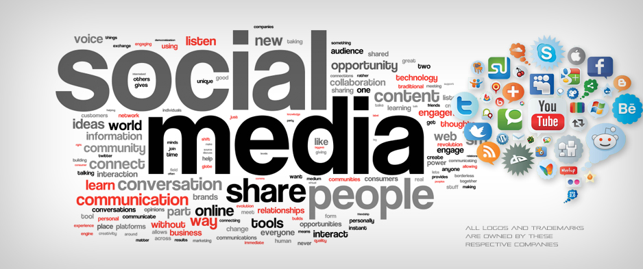

# 📱 Social Networking Website


A single-page social networking platform where users can register, log in, follow others, post content, search for users or posts, and view additional content powered by the **RawG Video Games Database API**.

---

<!-- Banner -->
<p align="center">
  
</p>

---

## 📑 Table of Contents
- [🚀 Features](#-features)
- [🛠️ Tech Stack](#️-tech-stack)
- [📸 Preview](#-preview)
- [🎥 Demo](#-demo)
- [⚙️ Installation & Setup](#️-installation--setup)

---

## 🚀 Features
- User registration & secure login  
- Follow/unfollow users  
- View feed from followed users  
- Create posts (text & optional media)  
- Search users and content  
- Fully AJAX-powered, no page reloads  
- **Third-party API Integration (RawG)** – Fetches and displays game data to enhance user experience

---

## 🛠️ Tech Stack
**Frontend:** HTML5, CSS3, JavaScript  
**Backend:** Node.js, Express, MongoDB (`mongodb` driver)  
**Third-party API:** [RawG Video Games Database API](https://rawg.io/apidocs) – for fetching real-time video game data  
**Architecture:** Single Page Application (SPA), REST API  

---

## 📸 Preview
**Homepage**  
<p align="center">
  
</p>

**Dark Mode**  
<p align="center">
  
</p>

**Postman API Testing**  
<p align="center">
  
</p>

---

## 🎥 Demo
Watch the full video demonstration here:  
[](https://www.youtube.com/watch?v=mgpNeBvm9OY)

---

## ⚙️ Installation & Setup

```bash
# Clone the repository
git clone https://github.com/Sanish1246/Single-page-social-networking-site.git
cd yourrepository

# Install dependencies
npm install

# Run the server
node server.js


# Open in your browser:
http://localhost:8080/M00980001/

